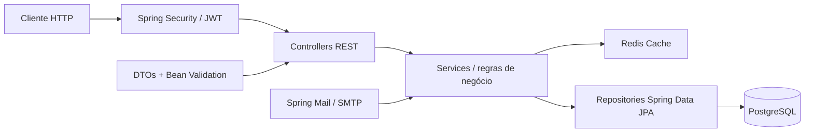

# 🎤 Artist Showcase API

            [](https://github.com/users/willfelixd/projects/4) [](https://choosealicense.com/licenses/mit/)   

> API REST desenvolvida com Java 17 + Spring Boot 3 para gerenciamento do
> portfólio da cantora Isa Tavares.
> Agenda de shows, repertório, vídeos e contato.

---

### 🌐 Produção

> Backend em produção no Render — infrastructure as code com deploy automático via GitHub Actions.

| | Link |
|---|---|
| 🚀 **API** | [artist-showcase-api.onrender.com](https://artist-showcase-api.onrender.com/api/health) |
| 📄 **Swagger** | [Documentação interativa](https://artist-showcase-api.onrender.com/swagger-ui/index.html) |

---

### 📌 Sobre o projeto

Este projeto consiste em uma API REST completa que serve como backend para
o portfólio digital da cantora Isa. A aplicação permite que o público
visualize informações da artista, consulte a agenda de shows, o repertório
musical e entre em contato — enquanto o admin gerencia tudo via painel
protegido com autenticação JWT.

#### 📋 Kanban

🗂️ **Acompanhe o progresso:** [Kanban - artist-showcase](https://github.com/users/willfelixd/projects/4)

<p>
  
</p>

> ⚠️ Projeto em desenvolvimento ativo. Novas funcionalidades serão adicionadas a cada fase.

---

### ⚙️ Funcionalidades

### Públicas
- ✅ Visualizar perfil da artista
- ✅ Listar e buscar músicas do repertório (filtro por gênero e título)
- ✅ Listar vídeos do YouTube com thumbnail e embed gerados automaticamente
- ✅ Consultar datas indisponíveis na agenda
- ✅ Solicitar agendamento de show com validação de conflito de horário
- ✅ Enviar mensagem de contato (rate limiting — 3 mensagens/hora por IP)

### Admin (requer autenticação JWT)
- ✅ Gerenciar perfil da artista
- ✅ CRUD completo de músicas
- ✅ CRUD completo de vídeos
- ✅ Gerenciar agendamentos (confirmar / cancelar)
- ✅ Visualizar mensagens de contato recebidas

---

### 🛠️ Tecnologias utilizadas
<details>
<summary><i>Clique aqui para ver o conteúdo</i></summary>

<br/>

| Tecnologia | Uso no projeto |
|---|---|
| Java 17 | Linguagem principal |
| Spring Boot 3.3.x | Configuração e execução da aplicação |
| Spring Web MVC | Endpoints REST |
| Spring Data JPA / Hibernate | Persistência e consultas |
| Spring Security + JWT | Autenticação e autorização |
| Spring Cache + Redis | Cache de endpoints de leitura |
| Spring Mail | Envio de e-mails via SMTP |
| Jakarta Validation | Validação dos dados de entrada |
| PostgreSQL | Banco de dados relacional |
| Lombok | Redução de código repetitivo nas entidades |
| Gradle | Dependências, build e execução |
| Docker + docker-compose | Containerização dos serviços |
| GitHub Actions | CI/CD automatizado |
| Swagger / OpenAPI 3 | Documentação interativa da API |

</details>

---

### 🧱 Arquitetura do projeto
<details>
<summary><i>Clique aqui para ver o conteúdo</i></summary>

<br/>

O projeto segue uma arquitetura em camadas:



O fluxo de uma requisição passa pelo filtro de segurança JWT, pelas regras
de negócio no service e pela camada de persistência. Endpoints de leitura
frequente são cacheados no Redis. Os DTOs definem os contratos de entrada
e saída da API.

</details>

---

### 📈 Evolução do projeto
<details>
<summary><i>Clique aqui para ver o conteúdo</i></summary>

<br/>

- [x] #1 Setup inicial do projeto
- [x] #2 Módulo de perfil da artista
- [x] #3 Migração para PostgreSQL com Docker
- [x] #4 Módulo de repertório musical
- [x] #5 Módulo de vídeos com integração YouTube
- [x] #6 Módulo de agenda com validação de conflitos
- [x] #7 Módulo de contato com e-mail e rate limiting
- [x] #8 Autenticação JWT e proteção de rotas admin
- [x] #9 Documentação Swagger, testes e logs estruturados
- [x] #10 Cache Redis e Docker completo
- [x] #11 Pipeline de CD e deploy no Render

</details>

---

### ▶️ Como executar o projeto
<details>
<summary><i>Clique aqui para ver o conteúdo</i></summary>

<br/>

### Pré-requisitos

- Java 17+
- Docker + docker-compose

### 1. Clonar o repositório

```bash
git clone https://github.com/willfelixd/artist-showcase-api.git
```

### 2. Entrar na pasta

```bash
cd artist-showcase-api
```

### 3. Configurar variáveis de ambiente

```bash
cp src/main/resources/application-dev.properties.example \
   src/main/resources/application-dev.properties

# Edite o arquivo com suas credenciais locais
```

### 4. Subir PostgreSQL e Redis

```bash
docker compose up postgres redis -d
```

### 5. Rodar a aplicação

- Opção A — rodar via IntelliJ/Gradle (desenvolvimento normal)
```bash
docker compose up postgres redis -d   # só banco e Redis
./gradlew bootRun                     # backend pelo Gradle
```

- Opção B — rodar tudo containerizado
```bash
docker compose up --build             # tudo via Docker, NÃO roda ./gradlew bootRun junto

# Sempre escolha um dos dois para rodar, nunca os dois ao mesmo tempo
```

<p>
  
</p>

A aplicação sobe em `http://localhost:8080`

O admin padrão é criado automaticamente no primeiro boot:
- **Usuário:** `admin`
- **Senha:** definida em `application-dev.properties`

### 6. Documentação da API

Após subir a aplicação, acesse: `http://localhost:8080/swagger-ui/index.html`

<p>
  
</p>

</details>

---

### 🔐 Segurança
<details>
<summary><i>Clique aqui para ver o conteúdo</i></summary>

<br/>

Gere um `JWT_SECRET` seguro com:
```bash
openssl rand -base64 64
```

Gere um `ADMIN_PASSWORD` seguro com:
```bash
openssl rand -base64 16
```

**MAIL_PASSWORD:**
App password do Gmail em — [Gerenciar sua Conta do Google](https://myaccount.google.com) → Segurança → Senhas de app

> ⚠️ Nunca commite credenciais reais. Os arquivos `application-dev.properties` e `.env` estão no `.gitignore`.

</details>

---

### 🔀 Fluxo de desenvolvimento
<details>
<summary><i>Clique aqui para ver o conteúdo</i></summary>

<br/>

Este projeto segue o GitHub Flow adaptado com branch de desenvolvimento:

```
main (protegida — só via PR de release)
└── develop (branch principal de trabalho)
    └── feature/nome-da-feature
         ↓ commit
         ↓ push
         ↓ PR → develop
         ↓ CI passa
         ↓ merge
         ↓ git checkout develop
         ↓ git pull origin develop       ← atualiza o local
         ↓ git branch -d feature/nome    ← deleta a branch local
```

### Padrão de branches

| Branch | Descrição |
|---|---|
| `main` | Produção — protegida, só recebe PR de release |
| `develop` | Desenvolvimento — base para todas as features |
| `feature/*` | Nova funcionalidade — ex: `feature/artist-profile` |
| `hotfix/*` | Correção urgente em produção |

### Padrão de commits

[Conventional Commits](https://www.conventionalcommits.org/):

```
feat: add artist profile module
fix: correct booking conflict validation
chore: update CI pipeline
docs: update README with Kanban GIF
```

### Ciclo completo de uma feature

1. Criar Issue no GitHub
2. `git checkout develop`
3. `git checkout -b feature/nome-da-feature`
4. Desenvolver e commitar
5. `git push origin feature/nome-da-feature`
6. Abrir PR → develop com template
7. CI passa
8. Merge → develop
9. Deletar branch da feature

### Release para produção

```
develop → PR → main → CI/CD → deploy automático no Render
```

</details>

---

### 🔌 Endpoints da API
<details>
<summary><i>Clique aqui para ver o conteúdo</i></summary>

<br/>

A documentação completa e interativa está disponível em `http://localhost:8080/swagger-ui/index.html`

### Autenticação — `/api/auth`

| Método | Endpoint | Acesso | Descrição |
|---|---|---|---|
| `POST` | `/api/auth/login` | Público | Login admin, retorna JWT |

### Perfil — `/api/artist`

| Método | Endpoint | Acesso | Descrição |
|---|---|---|---|
| `GET` | `/api/artist` | Público | Retorna perfil da artista |
| `PUT` | `/api/artist` | Admin | Atualiza perfil |

### Repertório — `/api/songs`

| Método | Endpoint | Acesso | Descrição |
|---|---|---|---|
| `GET` | `/api/songs` | Público | Lista músicas com filtros |
| `GET` | `/api/songs/most-requested` | Público | Músicas mais pedidas |
| `GET` | `/api/songs/{id}` | Público | Busca música por ID |
| `POST` | `/api/songs` | Admin | Cria música |
| `PUT` | `/api/songs/{id}` | Admin | Atualiza música |
| `DELETE` | `/api/songs/{id}` | Admin | Remove música |

### Vídeos — `/api/videos`

| Método | Endpoint | Acesso | Descrição |
|---|---|---|---|
| `GET` | `/api/videos` | Público | Lista vídeos |
| `GET` | `/api/videos/featured` | Público | Vídeos em destaque |
| `GET` | `/api/videos/{id}` | Público | Busca vídeo por ID |
| `POST` | `/api/videos` | Admin | Adiciona vídeo |
| `PUT` | `/api/videos/{id}` | Admin | Atualiza vídeo |
| `DELETE` | `/api/videos/{id}` | Admin | Remove vídeo |

### Agenda — `/api/bookings`

| Método | Endpoint | Acesso | Descrição |
|---|---|---|---|
| `GET` | `/api/bookings/unavailable-dates` | Público | Datas indisponíveis |
| `POST` | `/api/bookings` | Público | Solicita agendamento |
| `GET` | `/api/bookings` | Admin | Lista agendamentos |
| `GET` | `/api/bookings/status/{status}` | Admin | Filtra por status |
| `PATCH` | `/api/bookings/{id}/status` | Admin | Atualiza status |
| `DELETE` | `/api/bookings/{id}` | Admin | Remove agendamento |

### Contato — `/api/contact`

| Método | Endpoint | Acesso | Descrição |
|---|---|---|---|
| `POST` | `/api/contact` | Público | Envia mensagem |
| `GET` | `/api/contact` | Admin | Lista mensagens |
| `GET` | `/api/contact/failed` | Admin | Mensagens com falha no e-mail |
| `GET` | `/api/contact/{id}` | Admin | Detalhe da mensagem |

</details>

---

### 🧪 Testes
<details>
<summary><i>Clique aqui para ver o conteúdo</i></summary>

<br/>

```bash
./gradlew test
```

Ver relatório HTML:

```bash
# Linux / macOS
open build/reports/tests/test/index.html

# Windows
start build/reports/tests/test/index.html
```

Os testes usam H2 em memória — não precisam do Docker rodando.

</details>

---

### 📁 Estrutura de pastas
<details>
<summary><i>Clique aqui para ver o conteúdo</i></summary>

<br/>

```
src
├── 📂 main
│   ├── ☕ java
│   │   └── 📦 com.artistshowcase.api
│   │       ├── 🔧 config          # Cache, CORS, Security, Swagger
│   │       ├── 🌐 controller      # Endpoints REST
│   │       ├── 📋 dto             # Objetos de entrada e saída
│   │       ├── ⚠️ exception       # Exceções e handler global
│   │       ├── 🧩 model           # Entidades JPA
│   │       │   └── 🏷️ enums      # BookingStatus
│   │       ├── 🗄️ repository      # Interfaces Spring Data JPA
│   │       ├── 🔐 security        # Filtro JWT e JwtService
│   │       ├── ⚙️ service         # Regras de negócio
│   │       └── 🛠️ util            # YouTubeUtils
│   └── 📋 resources
│       ├── application.properties
│       ├── application-dev.properties.example
│       ├── application-prod.properties
│       └── logback-spring.xml
└── 🧪 test
    ├── ☕ java
    │   └── 📦 com.artistshowcase.api
    │       ├── 🌐 controller
    │       └── ⚙️ service
    └── 📋 resources
        └── application-test.properties
```

</details>

---

### 📸 Demonstração
<details>
<summary><i>Clique aqui para ver o conteúdo</i></summary>

<br/>

Swagger:
<p>
  
</p>

Painel Admin:
<p>
  
</p>

PostgreSQL com Docker:
<p>
  
</p>

Docker final:
<p>
  
</p>

Postman final:
<p>
  
</p>

</details>

---

### 📚 Aprendizados
<details>
<summary><i>Clique aqui para ver o conteúdo</i></summary>

<br/>

- Desenvolvimento de APIs REST com Spring Boot 3
- Arquitetura em camadas com separação de responsabilidades
- Autenticação stateless com Spring Security + JWT
- Modelagem de domínio com regras de negócio reais (agenda, conflitos)
- Cache estratégico com Redis e invalidação por escrita
- Testes unitários com Mockito e de integração com MockMvc
- Containerização com Docker e orquestração com docker-compose
- CI/CD com GitHub Actions e deploy automático no Render

</details>

---

### 🔗 Repositórios relacionados

* **Frontend:** [artist-showcase-ui](https://github.com/willfelixd/artist-showcase-ui)

---

### 📄 Licença

[](https://github.com/willfelixd/artist-showcase-api?tab=MIT-1-ov-file)

---

### ✍️ Autor

<table>
  <tr>
    <td align="center">
      <a href="https://github.com/willfelixd">
        
      </a><br/>
      <b>William Felix</b><br/>
      <a href="https://www.linkedin.com/in/william-felix-souza/">
        
      </a>
      <a href="mailto:willfelixd@gmail.com?subject=Proposta%20de%20Projeto&body=Olá,%20vi%20seu%20portfólio%20e%20gostaria%20de%20falar%20sobre%20um%20projeto.">
        
      </a>
    </td>
  </tr>
</table>