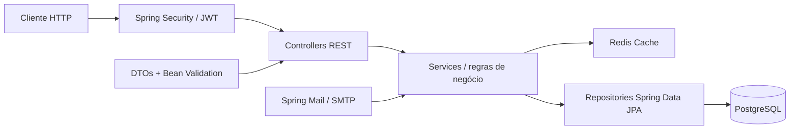

# 🎤 Artist Showcase API

    [](https://choosealicense.com/licenses/mit/)

> API REST desenvolvida com Java 17 + Spring Boot 3 para gerenciamento do
> portfólio da cantora Isa Tavares. 
> Agenda de shows, repertório, vídeos e contato.

---

## 📌 Sobre o projeto

Este projeto consiste em uma API REST completa que serve como backend para
o portfólio digital da cantora Isa. A aplicação permite que o público
visualize informações da artista, consulte a agenda de shows, o repertório
musical e entre em contato — enquanto o admin gerencia tudo via painel
protegido com autenticação JWT.

> ⚠️ Projeto em desenvolvimento ativo. Novas funcionalidades serão adicionadas
> a cada fase.

---

## 🛠️ Tecnologias utilizadas

| Tecnologia | Uso no projeto |
|---|---|
| Java 17 | Linguagem principal |
| Spring Boot 3.x | Configuração e execução da aplicação |
| Spring Web MVC | Endpoints REST |
| Spring Data JPA / Hibernate | Persistência e consultas |
| Spring Security + JWT | Autenticação e autorização |
| Spring Cache + Redis | Cache de endpoints de leitura |
| Spring Mail | Envio de e-mails via SMTP |
| Jakarta Validation | Validação dos dados de entrada |
| PostgreSQL | Banco de dados relacional |
| Lombok | Redução de código repetitivo nas entidades |
| Gradle | Dependências, build e execução |
| Docker + docker-compose | Containerização dos serviços |
| GitHub Actions | CI/CD automatizado |
| Swagger / OpenAPI 3 | Documentação interativa da API |

---

## 🧱 Arquitetura do projeto

O projeto segue uma arquitetura em camadas:



O fluxo de uma requisição passa pelo filtro de segurança JWT, pelas regras
de negócio no service e pela camada de persistência. Endpoints de leitura
frequente são cacheados no Redis. Os DTOs definem os contratos de entrada
e saída da API.

---

## 📈 Evolução do projeto

- [x] #1 Setup inicial do projeto
- [ ] #2 Módulo de perfil da artista
- [ ] #3 Migração para PostgreSQL com Docker
- [ ] #4 Módulo de repertório musical
- [ ] #5 Módulo de vídeos com integração YouTube
- [ ] #6 Módulo de agenda com validação de conflitos
- [ ] #7 Módulo de contato com e-mail e rate limiting
- [ ] #8 Autenticação JWT e proteção de rotas admin
- [ ] #9 Documentação Swagger, testes e logs estruturados
- [ ] #10 Cache Redis e Docker completo
- [ ] #11 Pipeline de CD e deploy no Render

---

## ⚙️ Funcionalidades

### Públicas
- ✅ Visualizar perfil da artista
- ✅ Listar e buscar músicas do repertório (filtro por gênero e título)
- ✅ Listar vídeos do YouTube com thumbnail e embed gerados automaticamente
- ✅ Consultar datas indisponíveis na agenda
- ✅ Solicitar agendamento de show com validação de conflito de horário
- ✅ Enviar mensagem de contato (rate limiting — 3 mensagens/hora por IP)

### Admin (requer autenticação JWT)
- ✅ Gerenciar perfil da artista
- ✅ CRUD completo de músicas
- ✅ CRUD completo de vídeos
- ✅ Gerenciar agendamentos (confirmar / cancelar)
- ✅ Visualizar mensagens de contato recebidas

---

## ▶️ Como executar o projeto

### Pré-requisitos

- Java 17+
- Docker + docker-compose

### 1. Clonar o repositório

```bash
git clone https://github.com/willfelixd/artist-showcase-api.git
```

### 2. Entrar na pasta

```bash
cd artist-showcase-api
```

### 3. Configurar variáveis de ambiente

```bash
cp src/main/resources/application-dev.properties.example \
   src/main/resources/application-dev.properties

# Edite o arquivo com suas credenciais locais
```

### 4. Subir PostgreSQL e Redis

```bash
docker compose up postgres redis -d
```

### 5. Rodar a aplicação

No Linux ou macOS:
```bash
./gradlew bootRun
```

No Windows:
```bash
gradlew.bat bootRun
```

A aplicação sobe em `http://localhost:8080`.

O admin padrão é criado automaticamente no primeiro boot:
- **Usuário:** `admin`
- **Senha:** definida em `application-dev.properties`

---

## 🔌 Endpoints da API

A documentação completa e interativa está disponível em `http://localhost:8080/swagger-ui/index.html`

Resumo dos principais endpoints:

### Autenticação — `/api/auth`

| Método | Endpoint | Acesso | Descrição |
|---|---|---|---|
| `POST` | `/api/auth/login` | Público | Login admin, retorna JWT |

### Perfil — `/api/artist`

| Método | Endpoint | Acesso | Descrição |
|---|---|---|---|
| `GET` | `/api/artist` | Público | Retorna perfil da artista |
| `PUT` | `/api/artist` | Admin | Atualiza perfil |

### Repertório — `/api/songs`

| Método | Endpoint | Acesso | Descrição |
|---|---|---|---|
| `GET` | `/api/songs` | Público | Lista músicas com filtros |
| `GET` | `/api/songs/most-requested` | Público | Músicas mais pedidas |
| `GET` | `/api/songs/{id}` | Público | Busca música por ID |
| `POST` | `/api/songs` | Admin | Cria música |
| `PUT` | `/api/songs/{id}` | Admin | Atualiza música |
| `DELETE` | `/api/songs/{id}` | Admin | Remove música |

### Vídeos — `/api/videos`

| Método | Endpoint | Acesso | Descrição |
|---|---|---|---|
| `GET` | `/api/videos` | Público | Lista vídeos |
| `GET` | `/api/videos/featured` | Público | Vídeos em destaque |
| `GET` | `/api/videos/{id}` | Público | Busca vídeo por ID |
| `POST` | `/api/videos` | Admin | Adiciona vídeo |
| `PUT` | `/api/videos/{id}` | Admin | Atualiza vídeo |
| `DELETE` | `/api/videos/{id}` | Admin | Remove vídeo |

### Agenda — `/api/bookings`

| Método | Endpoint | Acesso | Descrição |
|---|---|---|---|
| `GET` | `/api/bookings/unavailable-dates` | Público | Datas indisponíveis |
| `POST` | `/api/bookings` | Público | Solicita agendamento |
| `GET` | `/api/bookings` | Admin | Lista agendamentos |
| `GET` | `/api/bookings/status/{status}` | Admin | Filtra por status |
| `PATCH` | `/api/bookings/{id}/status` | Admin | Atualiza status |
| `DELETE` | `/api/bookings/{id}` | Admin | Remove agendamento |

### Contato — `/api/contact`

| Método | Endpoint | Acesso | Descrição |
|---|---|---|---|
| `POST` | `/api/contact` | Público | Envia mensagem |
| `GET` | `/api/contact` | Admin | Lista mensagens |
| `GET` | `/api/contact/failed` | Admin | Mensagens com falha no e-mail |
| `GET` | `/api/contact/{id}` | Admin | Detalhe da mensagem |

---

## 🧪 Testes

```bash
./gradlew test
```

Ver relatório HTML:

```bash
# Linux / macOS
open build/reports/tests/test/index.html

# Windows
start build/reports/tests/test/index.html
```

Os testes usam H2 em memória — não precisam do Docker rodando.

---

## 📁 Estrutura de pastas

src
├── 📂 main
│   ├── ☕ java
│   │   └── 📦 com.artistshowcase.api
│   │       ├── 🔧 config        # Cache, CORS, Security, Swagger
│   │       ├── 🌐 controller    # Endpoints REST
│   │       ├── 📋 dto           # Objetos de entrada e saída
│   │       ├── ⚠️ exception     # Exceções e handler global
│   │       ├── 🧩 model         # Entidades JPA
│   │       │   └── 🏷️ enums    # BookingStatus
│   │       ├── 🗄️ repository   # Interfaces Spring Data JPA
│   │       ├── 🔐 security      # Filtro JWT e JwtService
│   │       ├── ⚙️ service       # Regras de negócio
│   │       └── 🛠️ util         # YouTubeUtils
│   └── 📋 resources
│       ├── application.properties
│       ├── application-dev.properties.example
│       ├── application-prod.properties
│       └── logback-spring.xml
└── 🧪 test
├── ☕ java
│   └── 📦 com.artistshowcase.api
│       ├── 🌐 controller
│       └── ⚙️ service
└── 📋 resources
└── application-test.properties

---

## 📸 Demonstração

*(Em breve — prints do Swagger e do painel admin)*

<p>
  
</p>

---

## 📚 Aprendizados

- Desenvolvimento de APIs REST com Spring Boot 3
- Arquitetura em camadas com separação de responsabilidades
- Autenticação stateless com Spring Security + JWT
- Modelagem de domínio com regras de negócio reais (agenda, conflitos)
- Cache estratégico com Redis e invalidação por escrita
- Testes unitários com Mockito e de integração com MockMvc
- Containerização com Docker e orquestração com docker-compose
- CI/CD com GitHub Actions e deploy automático no Render

---

## 🔗 Repositórios relacionados

* **Frontend:** [artist-showcase-ui](https://github.com/willfelixd/artist-showcase-ui)
*(em desenvolvimento)*

---

## 📄 Licença

[](https://choosealicense.com/licenses/mit/)

---

## ✍️ Autor

<table>
  <tr>
    <td align="center">
      <a href="https://github.com/willfelixd">
        <br />
        <sub><b>William Felix</b></sub>
      </a>
    </td>
  </tr>
</table>

[](https://www.linkedin.com/in/william-felix-souza/) [](mailto:willfelixd@gmail.com?subject=Proposta%20de%20Projeto&body=Olá,%20vi%20seu%20portfólio%20e%20gostaria%20de%20falar%20sobre%20um%20projeto.)
